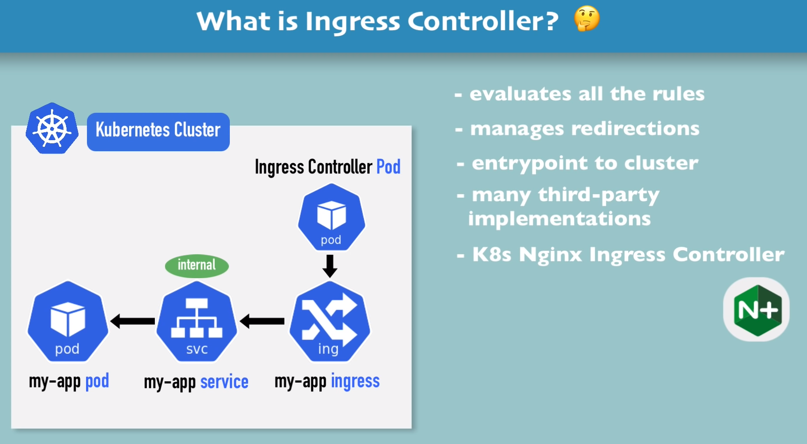
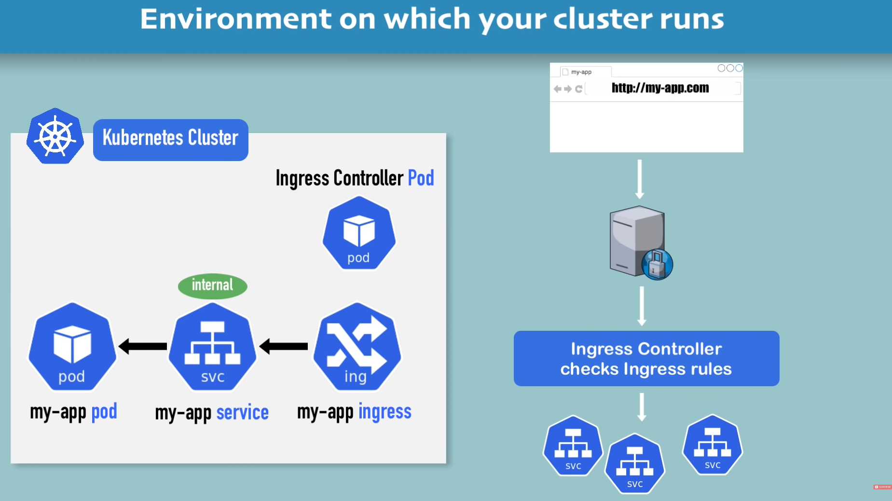

Ingress - like a external service:



`minikube addons enable ingress` - enables ingress on minikube and configure it automatically
`kubectl get pod -n kube-system -A` - lists addons

```yaml
apiVersion: networking.k8s.io/v1
kind: Ingress
metadata:
  name: dashboard-ingress
  namespace: kubernetes-dashboard
spec:
  rules:
  - host: dashboard.com
    http:
      paths:
      - path: /
        pathType: Prefix
        backend:
          service:
            name: kubernetes-dashboard
            port:
             number: 80
```
`kubectl get ingress -n kubernetes-dashboard`
The IP Address will be assigned soon.
```shell
nick-kharaim@nick-kharaim-E5470:~/Documents/projects/k8s/ingress$ kubectl get ingress -n kubernetes-dashboard
NAME                CLASS   HOSTS           ADDRESS          PORTS   AGE
dashboard-ingress   nginx   dashboard.com   192.168.39.101   80      118s
```
the ip must be added to the /etc/hosts on a local machine:
`192.168.39.101 dashboard.com`

