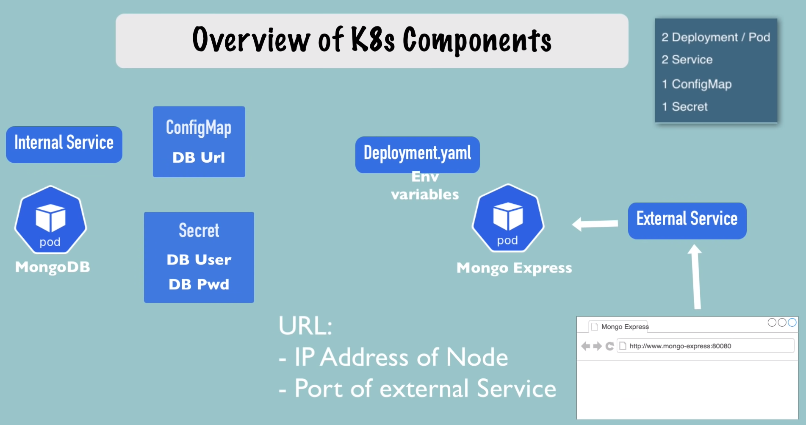
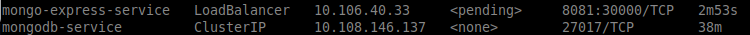

Example of a cluster:



A secret must be created before deployment. After applying we can chet it by:
`kubectl get secret`


A service. To make of it an external service, we need add the "type: LoadBalancer" to the "spec" and by adding the "nodePort" (30000-32767):
```yaml
apiVerion: v1
kind: Service
metadata:
  name: mongo-express-service
spec:
  selector:
    app: mongo-express
  type: LoadBalancer
  ports:
    - protocol: TCP
      port: 8081
      targetPort: 8081
```

`kubectl get service`


Minikube works differently and so it's displaying the external ip for the service as "pending"
Need to `minikube service mongo-express-service` so the public IP were attributed
