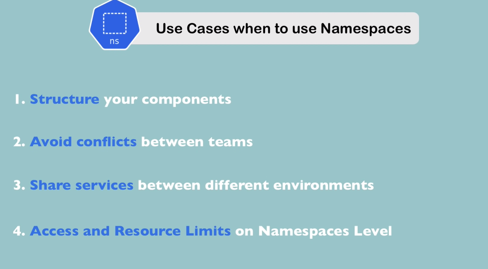

Example of a cluster:


A secret must be created before deployment. After applying we can chet it by:
`kubectl get secret`


A service. To make of it an external service, we need add the "type: LoadBalancer" to the "spec" and by adding the "nodePort" (30000-32767):
```yaml
apiVerion: v1
kind: Service
metadata:
  name: mongo-express-service
spec:
  selector:
    app: mongo-express
  type: LoadBalancer
  ports:
    - protocol: TCP
      port: 8081
      targetPort: 8081
```

`kubectl get service`


Minikube works differently and so it's displaying the external ip for the service as "pending"
Need to `minikube service mongo-express-service` so the public IP were attributed

------------------------

**Namespaces**
NS - virtual cluster in a cluster
`kubectl get namespace`
4 NS by default
- kube-system: system services
- kube-public: config maps
- kube-node-lease: heartbeats of nodes, each node has a lease
- default

Better to group resources by cluster:


Use cases:


Config map should contain a service prefix:


Not all resources can be put under a Namespace:


Namespace can be created:
`kubect apply -f [file.yaml] --namespace=namespace`
OR by putting it in the file:

(better documented)

We can change the active namespace by using "kubens":
`kubens my-namespace`

