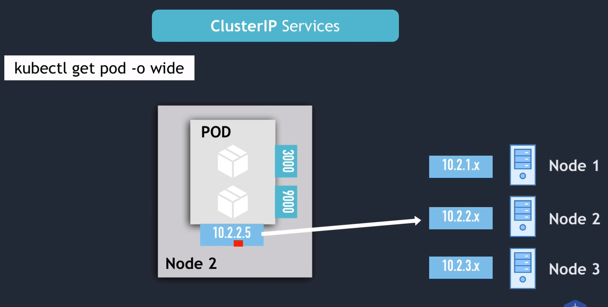
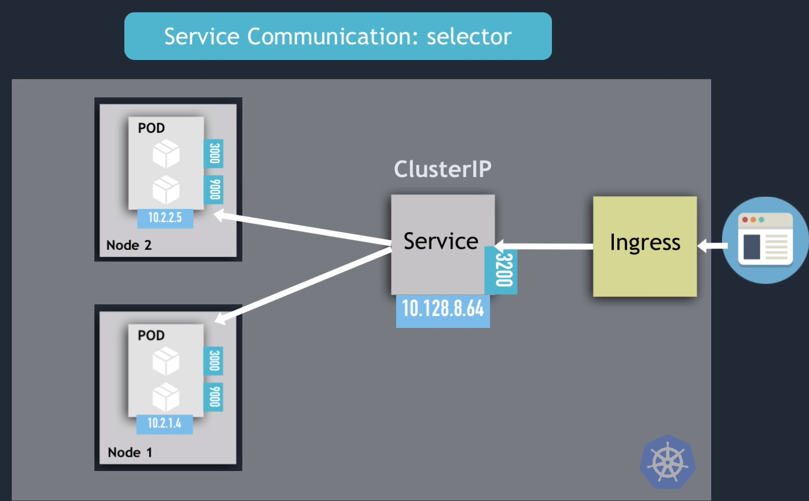

# Services

ClusterID is default

K8S creates Endpoint object:

Service communication:

Multi port Services:

Headless Service:

Node port:

LoadBalancer service:

We can do loadbalancer a entrypoint for the node and not directly connect to it.

