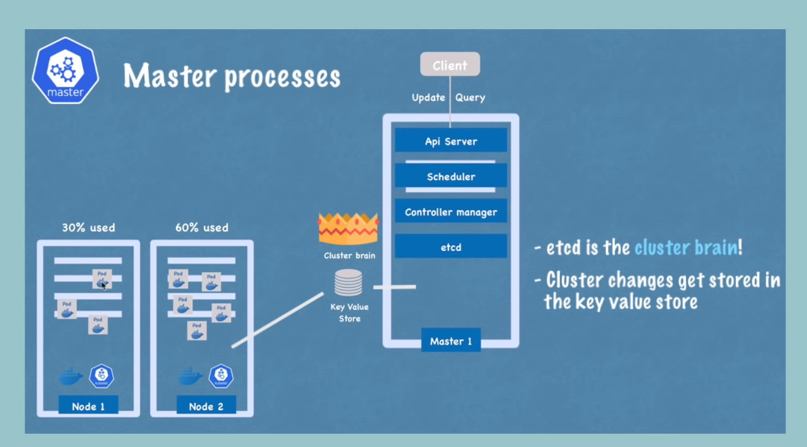
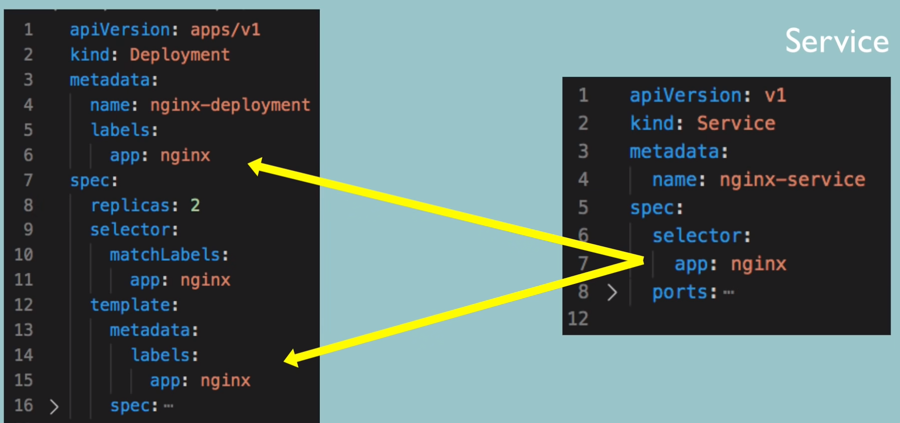
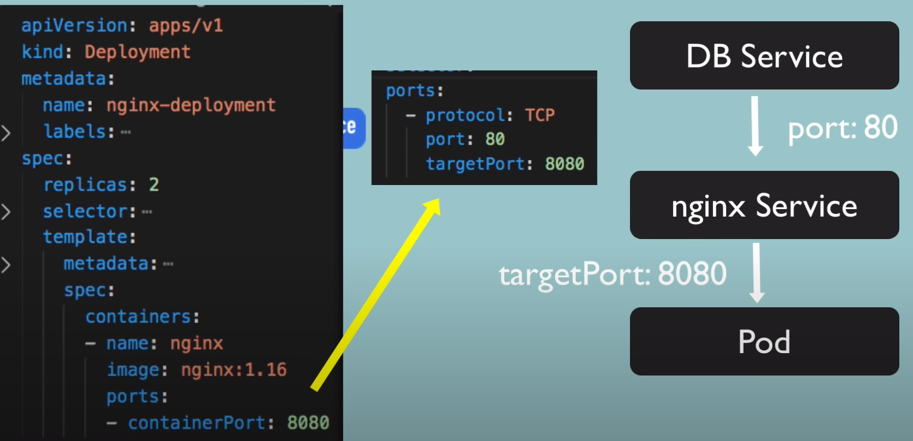

``

Create a deployment:
`kubectl create deployment nginx-depl --image=nginx`

Get replicaset:
`kubectl get replicaset`

Edit a deployment:
`kubectl edit deployment nginx-depl`

Describe a pod:
`kubectl describe pod [pod name]`

Log:
`kubectl logs [pod name]`

Exec:
`kubectl exec -it [pod name] -- bin/bash`

Create and edit form a file:
`kubectl apply -f nginx-deployment.yaml`
while editing if exists, it will know that is an edition

-----------------

Configuration file:
1. Metadata
2. Specification
3. Status

K8S has a "self healing" feature, and it traces a actual status of a deployment, and it compares it to the desired state.

"etcd" is the cluster brain, cluster changes get stored in the ke value store.

YAML online validator can be useful.

Deployment config has its own "metadata" and "spec" in the "spec.template" section:
spec.template.spec - is a "blueprint" for a pod: image, name, port etc

---------------------
**Labels**
DEPLOYMENT "spec.selector.matchLabels" - that the way for a deployment to know the pods that belong to it.
DEPLOYMENT "metadata.labels" - are used by service selector
SERVICE "spec.selector" - the selector matches a deployment metadata.labels and DEPLOYMENT POD "template.metadata.labels"

SERVICE ports targetPort must match a pod's "containerPort"

`kubectl describe service [pod name]` - shows service details, ex, Endpoints
`kubectl get pod -o wide` - shows more details on pods, IPs

`kubectl get deployment nginx-deployment -o yaml` - shows updated configuration of the deployment (that is in the etcd store)

`kubectl delete -f nginx-deployment.yaml` - deletes a deployment or service basing of a yaml file

